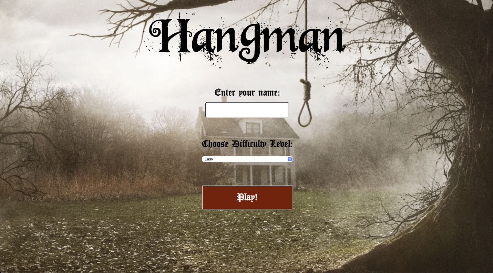
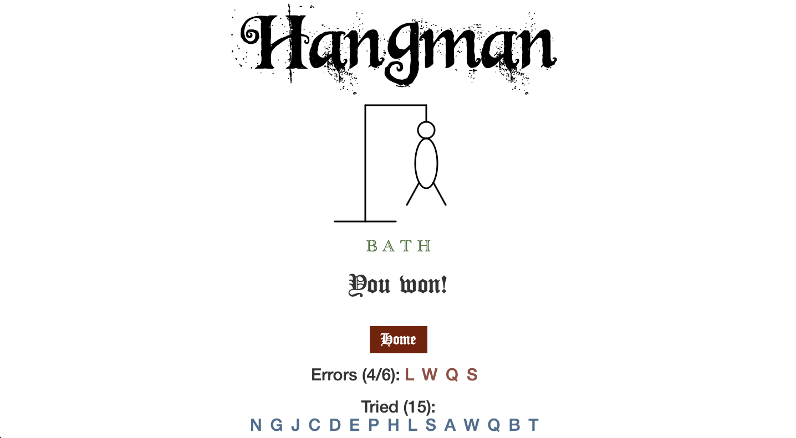

# Hangman

Simple hangman game implemented with Flask

# User Manual

## How to run the game

You can download the source files and run "python hangman.py" to run it in the browser

## Description:

A game where you guess a mystery (hidden) word one letter at a time within a certain limit of tries. Each time the wrong letter is guessed a part of the man appears, when every single body part appears on the man, he is hanged and the game ends. 

## Objective:

The objective of the game is to guess the hidden word before the number of tries run out (or before the man is hanged). In this case the user has a maximum of six possible errors before the man is hanged and the user loses. 

## How to play:

Begin with entering your name in the input field below Enter your name: 
Choose your desired difficulty by selecting the dropdown menu under Choose Difficulty Level: and choose between three modes (easy, medium, hard)
Click the play button when the name and desired difficulty is inputted, the game should then begin.
Note: If  name is not selected an alert will pop up.
Note: If difficulty level is not selected it will automatically be set to easy.
In the text field, start by inputting the letters that could possibly be a part of the word. You can enter letters one at a time, or enter an entire word that is the same length as the hidden word. 
Note: The game is lost if you enter the wrong word, or if you enter 6 wrong letters. 
Note: If the word that is imputed is not of the same length as the hidden word, the word will be ignored. (Refer to Rule 3.1)
If the word is guessed correctly, the game is won. 
Once the game is finished (regardless of a win or loss) you can choose to play again or return to home by clicking the respective buttons. 
If the play again button is selected, the game begins again. (Refer to how to play step 4)
The leaderboard may display the player's name if the player's game points are among the top 10. (Refer to Rule 5 to see how game points are calculated)

## Rules:

The game does not start if the player's name is not entered. 
The game only begins to count errors after the first letter is guessed correctly, errors will be displayed but will not be counted towards six possible errors.
In the input box:
One letter can be inputted at a time or the entire word of the same length as the hidden word (the length of the hidden word can be noted by the number of underscores ‘_’ ).
You lose the game when:
You run out of tries while guessing the letters in the word
You enter an incorrect guess of the word with the same length as the hidden word.
Game points are calculated based on the length of the word and the number of errors. The leaderboard displays the player name, the word, the errors made and the game points for players ranked in the top 10. 

## Modes:

The game includes 3 difficulty modes (easy, medium, hard):
Easy allows for 6 tries for a 4 to 6 letter word.
Medium allows for 6 tries for a word between 6 to 9 letters.
Hard allows for 6 tries for words longer than 9 letters.

# Screenshots

# Links

* Hangman github repository: https://github.com/vlopezferrando/hangman
* Slides: https://slides.com/victorlf/flask
* Flask: http://flask.pocoo.org
* Jinja2: http://jinja.pocoo.org/docs/dev/
* Bootstrap: http://getbootstrap.com
* JQuery: https://jquery.com
